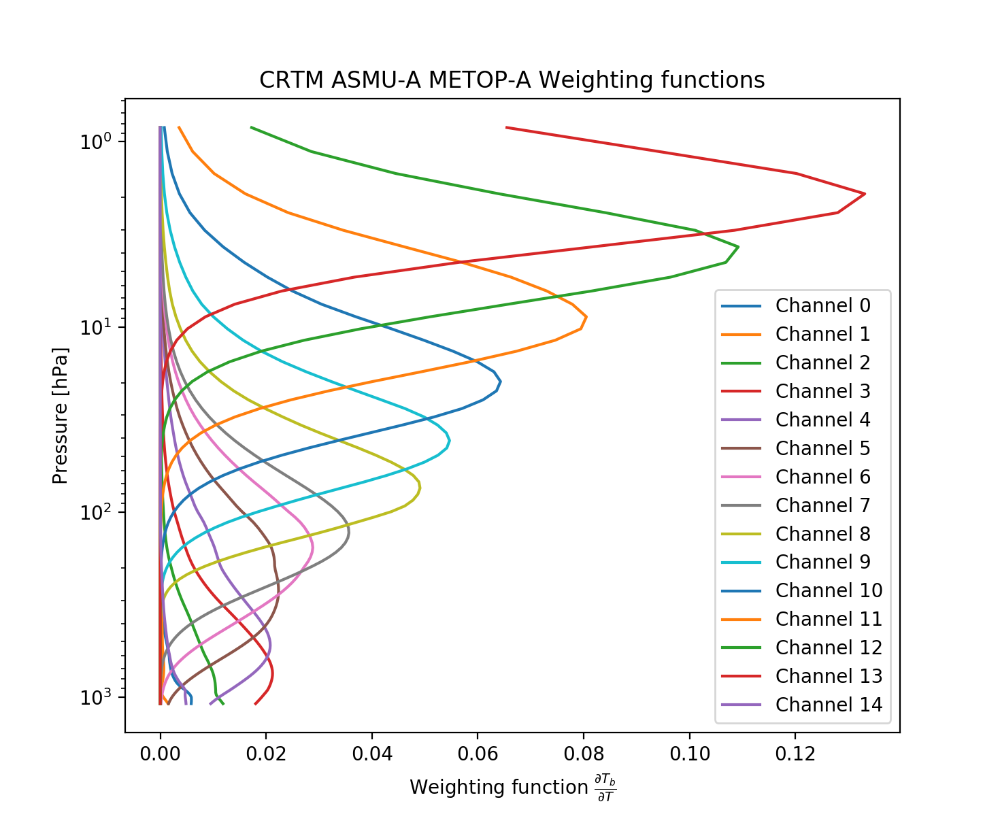

# Short Description
This tutorial demonstrates how to use the CRTM to compute the Jacobian matrix (or K-matrix) for an example test case involving AMSU-A.
The so-called K-Matrix, or Jacobian is used in linear(-ized) retrieval problems to relate the measurement vector `y` to the state vector `x`:
```Fortran
y = MATMUL(K,x)
```
# Code Description
First, calling CRTM procedures requires loading the CRTM module:
```Fortran
USE CRTM_Module
```
With this out of the way, the desired instrument can be selected:
```Fortran
Sensor_Id = 'amsua_metop-a'
...
Error_Status = CRTM_Init( (/Sensor_Id/), &  ! Input... must be an array, hence the (/../)
                         ChannelInfo  , &  ! Output
                         File_Path='coefficients/' )
```
Atmosphere and surface data are loaded externally for this test case:
```Fortran
CALL Load_Atm_Data()
CALL Load_Sfc_Data()
```
As the Jacobian for this AMSU-A test case is the derivative of the channel brightness temperatures w.r.t. the atmospheric state, the atmosphere data structure needs to be set to zero:
```Fortran
! 5a. Zero the K-matrix OUTPUT structures
! ---------------------------------------
CALL CRTM_Atmosphere_Zero( Atmosphere_K )
CALL CRTM_Surface_Zero( Surface_K )
```
and the brightness temperature needs to be set to 1 for all desired channels, as is necessary in reverse algorithmic differentiation:
```
! 5b. Inintialize the K-matrix INPUT so
!     that the IR/MW results are dTb/dx
!     and the visible results are dR/dx
! -------------------------------------
DO l = 1, n_Channels
  IF ( ChannelInfo(1)%Sensor_Type == INFRARED_SENSOR .OR. &
       ChannelInfo(1)%Sensor_Type == MICROWAVE_SENSOR ) THEN
    RTSolution_K(l,:)%Radiance               = ZERO
    RTSolution_K(l,:)%Brightness_Temperature = ONE
    ...
  END IF
END DO
```
The full K-matrix is then computed by calling:
```Fortran
Error_Status = CRTM_K_Matrix( Atm         , &
                              Sfc         , &
                              RTSolution_K, &
                              Geometry    , &
                              ChannelInfo , &
                              Atmosphere_K, &
                              Surface_K   , &
                              RTSolution  )
```
After the computation, the Jacobian is stored in the `Atmosphere_K` datastructure of type `CRTM_Atmosphere_type`.
Writing the Jacobian of the channel brightness temperatures w.r.t. the atmospheric temperature profile for channels 6 to 10 to `output_K.txt` can then be achieved like so:
```Fortran
OPEN(UNIT=66,FILE='output_K.txt',STATUS='NEW')
...
DO l = 6, 10
  WRITE(66,*) Atmosphere_K(l,1)%Temperature
END DO 
CLOSE(66)
```
Finally, all CRTM data structures need to be deallocated.

# Running the test case
Below is a walkthrough for all the steps of this tutorial case.

## Compilation
In order to compile the test, simply type 
```
make 
```
in this folder.

### If something goes wrong...
The `makefile` expects the CRTM installation to reside in `/usr/local/crtm_v2.3.0/`.
If this is not the case for installation, you need to modify the CRTM path in the makefile accordingly.
The `makefile` is written for the `gfortran`  compiler. If you are using a different compiler, please modify the `FCC` variable accordingly.

## Running the computations
If the compilation was successful, an executable called `K.x` is created.
In order to run the executable, first type 
```
rm output_*
```
to remove the existing output files, and then 
```
./K.x
```
to run the actual executable for this example. This will produce two output text files called *output_K.txt* and *output_P.txt* 
The first file contains the computed K-matrix, while the second file contains the atmospheric pressure profile upon which the computation is based.

## Plotting the results
In order to plot the resuts, simply type:
```
python plot.py
```
This python script will read both `*.txt` output files and produce the following plot of the weighting functions:

